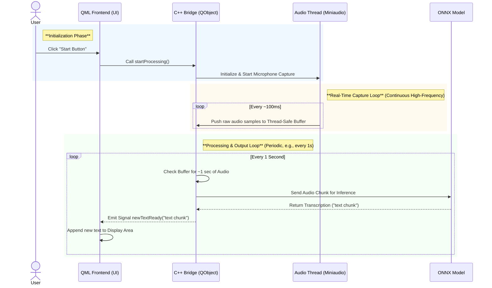

```mermaid
sequenceDiagram
    actor User
    participant QML as QML Frontend (UI)
    participant Bridge as C++ Bridge (QObject)
    participant Audio as Audio Thread (Miniaudio)
    participant AI as ONNX Model

    rect rgb(240, 248, 255)
    note right of User: **Initialization Phase**
    User->>QML: Click "Start Button"
    QML->>Bridge: Call startProcessing()
    Bridge->>Audio: Initialize & Start Microphone Capture
    end

    rect rgb(255, 250, 240)
    note right of Audio: **Real-Time Capture Loop** (Continuous High-Frequency)
    loop Every ~100ms
        Audio->>Bridge: Push raw audio samples to Thread-Safe Buffer
    end
    end

    rect rgb(245, 255, 245)
    note right of Bridge: **Processing & Output Loop** (Periodic, e.g., every 1s)
    loop Every 1 Second
        Bridge->>Bridge: Check Buffer for ~1 sec of Audio
        Bridge->>AI: Send Audio Chunk for Inference
        AI-->>Bridge: Return Transcription ("text chunk")
        Bridge-->>QML: Emit Signal newTextReady("text chunk")
        QML->>QML: Append new text to Display Area
    end
    end
```